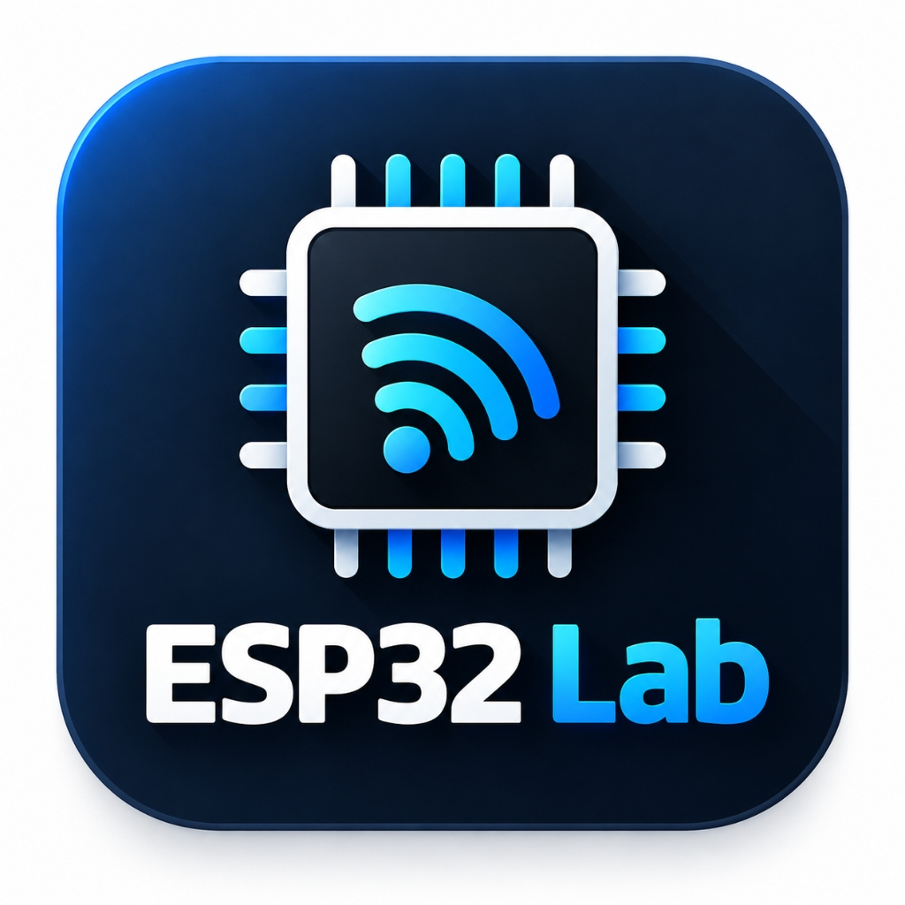
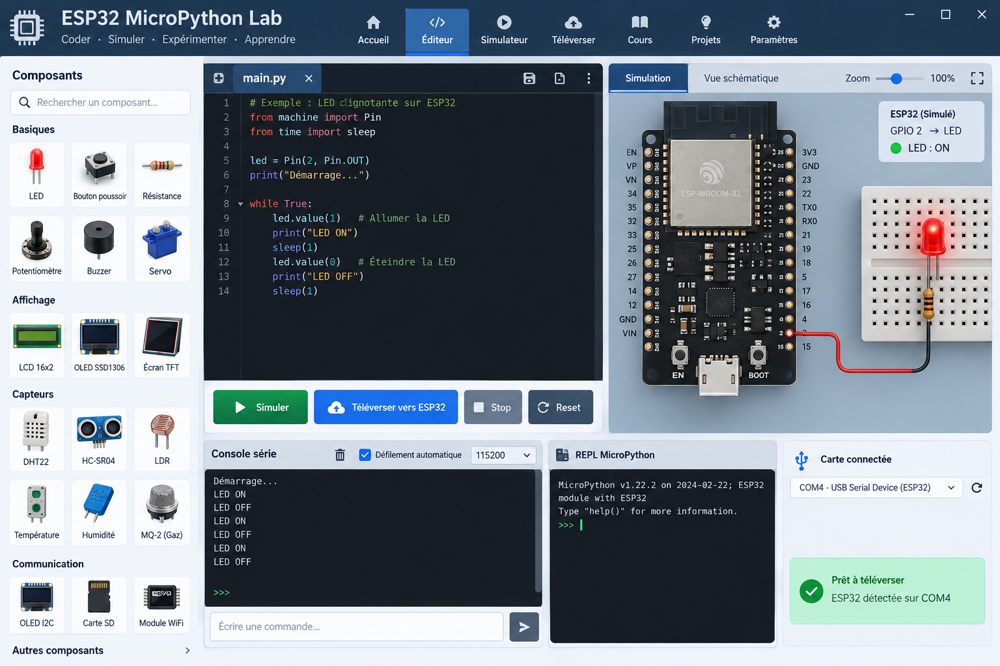

# ⚡ ESP32 MicroPython Lab

### Laboratoire Virtuel d'Électronique & de Programmation MicroPython pour ESP32
*Virtual MicroPython Programming & Electronics Laboratory for ESP32*

[-0078d7.svg?style=for-the-badge&logo=windows)](https://github.com/cryzo-py/ESP32-MicroPython-Lab/releases/latest)

 

**Conçu & Développé par [Fares Bel Haj Ali](https://github.com/cryzo-py)**  
📧 Contact : [belhadj.fares@gmail.com](mailto:belhadj.fares@gmail.com)

 

[-0284c7?style=for-the-badge&logo=windows&logoColor=white)](https://github.com/cryzo-py/ESP32-MicroPython-Lab/releases/download/v2.0/ESP32_MicroPython_Lab_Setup_v2.0.exe)
[-334155?style=for-the-badge&logo=zip&logoColor=white)](https://github.com/cryzo-py/ESP32-MicroPython-Lab/releases/download/v2.0/ESP32_MicroPython_Lab_v2.0_Portable.zip)

---

## 📸 Aperçu de l'Interface

  

---

## 📖 Présentation

**ESP32 MicroPython Lab** est un environnement d'apprentissage et d'expérimentation interactif tout-en-un dédié à l'électronique embarquée, au prototypage sur microcontrôleur ESP32 et à la programmation en **MicroPython**.

Conçu pour les lycées, universités, centres de formation, makers et passionnés d'IoT, il permet de concevoir des montages électroniques réalistes sur **platine d'essai MB-102**, de les câbler avec des **fils Dupont interactifs**, de programmer en MicroPython et d'exécuter la simulation en temps réel sans nécessiter de matériel physique dans un premier temps.

---

## 🚀 Téléchargement & Installation

### Option 1 : Installateur Windows automatique (Recommandé)
1. Téléchargez le fichier **[ESP32_MicroPython_Lab_Setup_v2.0.exe](https://github.com/cryzo-py/ESP32-MicroPython-Lab/releases/download/v2.0/ESP32_MicroPython_Lab_Setup_v2.0.exe)**.
2. Exécutez l'installateur et choisissez votre langue (**Français** ou **English**).
3. L'installation crée automatiquement les raccourcis sur le Bureau et dans le menu Démarrer, et associe les fichiers de projet `.lab32`.
4. Lancez **ESP32 MicroPython Lab** et commencez à expérimenter !

### Option 2 : Version Portable autonome (Sans installation)
1. Téléchargez l'archive **[ESP32_MicroPython_Lab_v2.0_Portable.zip](https://github.com/cryzo-py/ESP32-MicroPython-Lab/releases/download/v2.0/ESP32_MicroPython_Lab_v2.0_Portable.zip)**.
2. Décompressez l'archive dans le dossier de votre choix (ou sur une clé USB).
3. Lancez directement `ESP32_Lab.exe`.

---

## ✨ Fonctionnalités Majeures

- 🖥️ **Laboratoire Virtuel Réaliste** :
  - Platine d'essai (Breadboard MB-102) standard 830 contacts avec modèle de continuité physique complet.
  - Câblage Dupont interactif : insertion dynamique dans les trous de la platine, coudes déplaçables, code couleur standardisé.
- ⚡ **Moteur de Simulation MicroPython Temps Réel** :
  - Support natif des modules : `machine.Pin`, `machine.PWM`, `machine.ADC`, `machine.I2C`, `time.sleep`, `neopixel.NeoPixel`, etc.
  - Exécution en arrière-plan réactive avec interruption immédiate (Stop / Reset).
  - Passerelle Réseau Réelle (Host Network Bridge) permettant à l'ESP32 simulé d'effectuer de vraies requêtes HTTP et sockets IoT via la connexion du PC hôte.
- 🛡️ **Validateur de Règles Électriques (ERC)** :
  - Détection automatique des courts-circuits VCC / GND.
  - Vérification des conflits logiques (sorties numériques reliées en court-circuit).
  - Détection des LED sans résistance de limitation de courant.
- 🎓 **Cursus Pédagogique & Auto-évaluation (10 TPs complets)** :
  - Cursus guidé pas à pas : de la LED clignotante aux stations météo IoT, écrans OLED et bus I2C.
  - Moteur d'évaluation automatique notant le montage et le code de l'élève.
  - Exportation de comptes-rendus de TP au format HTML et export de nomenclature (BOM CSV).
- 📊 **Instrumentation Virtuelle & Télémétrie** :
  - Oscilloscope et analyseur logique intégrés pour observer les signaux PWM et temporels.
  - Console série interactive et terminal REPL MicroPython bidirectionnel.
  - Tableau de bord de l'état matériel (Hardware Status) en direct.
- 🌐 **Entièrement Bilingue (Français & Anglais)** :
  - Basculement instantané entre Français et Anglais depuis le menu Affichage ou dès l'installateur.
- 🎨 **Double Thème Interface (Sombre & Clair)** :
  - Mode sombre moderne et mode clair haute visibilité adapté aux vidéoprojecteurs.

---

## 🎛️ Composants Simulés

| Catégorie | Composants inclus |
| :--- | :--- |
| **Microcontrôleur & Platine** | ESP32 DevKit V1 (30 broches), Platine d'essai MB-102 (830 points) |
| **Composants de base** | Diodes LED (Rouge, Verte, Bleue, Jaune), Résistances (220Ω, 330Ω, 1kΩ, 10kΩ...), Bouton-Poussoir, Interrupteur SPDT, Potentiomètre rotatif, Joystick 2 axes, Buzzer piézoélectrique, Module Relais 5V, Servomoteur angulaire SG90 |
| **Optique & Affichage** | LED RGB 5mm (cathode commune), Ruban / Anneau NeoPixel WS2812B, Écran graphique OLED SSD1306 128x64 (I2C), Écran alphanumérique LCD 1602 (I2C) |
| **Capteurs environnementaux** | Photorésistance LDR, Capteur de mouvement PIR HC-SR501, Capteur Température & Humidité DHT22, Télémètre ultrasons HC-SR04 |

---

## 🖥️ Configuration Requise

- **Système d'exploitation** : Windows 10 ou Windows 11 (64-bit)
- **Processeur** : Intel / AMD Dual Core 1.5 GHz ou supérieur
- **Mémoire vive (RAM)** : 2 Go minimum (4 Go recommandés)
- **Espace disque** : 150 Mo d'espace libre
- **Affichage** : Résolution 1280 x 720 minimum (1920 x 1080 recommandée)

---

## 📄 Licence & Droits d'auteur

**Copyright © 2024-2026 Fares Bel Haj Ali. Tous droits réservés.**

Ce logiciel est distribué sous licence propriétaire à usage pédagogique et personnel. La décompilation, l'ingénierie inverse et la redistribution commerciale sans autorisation préalable de l'auteur sont strictement interdites. Pour toute demande institutionnelle ou de licence établissement, veuillez contacter l'auteur : [belhadj.fares@gmail.com](mailto:belhadj.fares@gmail.com).
