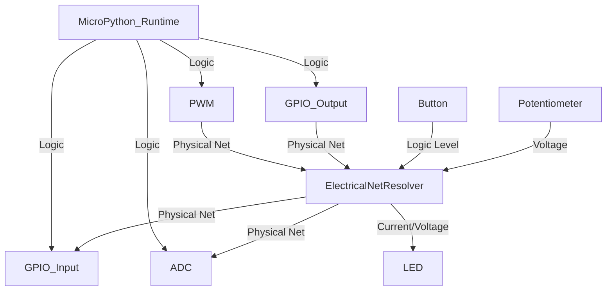

# GPIO Integration Architecture

This document describes the complete integration architecture of GPIO (Input, Output), ADC, and PWM in the ESP32 MicroPython Lab simulator.

## 1. Architecture Overview

The simulation uses the physical `ElectricalNetResolver` as the single source of truth for all connectivity. The `MicroPythonRuntime` evaluates code in an isolated thread and interacts with the hardware through managers (`GPIOManager`, `ADCManager`, `PWMManager`).

## 2. Electrical Net Resolver

The `ElectricalNetResolver` correctly maps internal breadboard strips, jumper wires, and component pins to determine continuous electrical networks (Nets).

## 3. GPIO Input & Floating States

GPIO Input reads evaluate the complete state of the connected net:
- If `3V3`, `VCC` or an OUTPUT GPIO set to `HIGH` is connected, it reads `1` (`HIGH`).
- If `GND` or an OUTPUT GPIO set to `LOW` is connected, it reads `0` (`LOW`).
- If no active source is connected, the pin evaluates its internal pull state (`PULL_UP`, `PULL_DOWN`), or remains `FLOATING` (reads `0`).

## 4. Conflict Resolution

If a net contains both a `HIGH` source (e.g. `3V3` or `OUTPUT HIGH`) and a `LOW` source (e.g. `GND` or `OUTPUT LOW`), the system detects a `CONFLICT`. The `DigitalState` is marked as `CONFLICT`, and the input reads `0` by default.

## 5. Hot Topology Changes

Topology updates (disconnects, reconnects) are handled dynamically by the `EventBus` triggering a re-evaluation of the `ElectricalNetResolver`. Components connected to updated nets are instantly notified, ensuring no "zombie states" exist when wires are moved.
